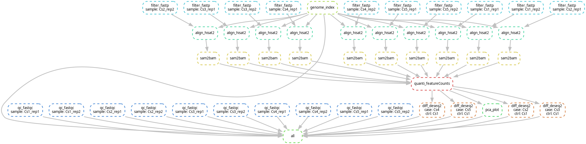

# Environment
- 📮 System=CentOS 7
- 📦 Snakemake=7.32.3
- 📌 Singularity=3.5.2
- 🎆 Python=3.13.5
- 🎉 R=4.4.3
- ***
# Description
* A bulkrna-seq pipeline base on [snakemake](https://snakemake.readthedocs.io/en/stable/) workflow that able to complete primary analysis.
* [Singularity](https://sylabs.io/singularity/) is supported in pipeline.
* Pipeline supports execution in HPC environments and uses [Slurm](https://slurm.schedmd.com/documentation.html) for job submition and management.
* If you use pipeline in your paper don't forget citing the URL of this repository,thanks!<br>
# Graph of jobs

# Preparation
## Clone
```shell
git clone https://github.com/BioinfoCSM/bulkrna_pipeline2.git
cd bulkrna_pipeline2
```
## Deployment
```shell
#copy your reference genome fasta and gtf annotation file to bulkrna_pipeline2/ref and rename genome.fa/genes.gtf separately
mkdir ref
cp path/your_reference.fa ref/genome.fa
cp path/your_annotation.gtf ref/genes.gtf
#pull a singularity container to bulkrna_pipeline2/image
mkdir image
cd image
singularity pull --arch amd64 library://bioinfocsm/share/bulkrna:v1.0
or
singularity pull --arch amd64 library://bioinfocsm/share/bulkrna:sha256.5d3b05d0f6021dacea1d5bd2a411f5c411466feb36fb7a6ff8bed0a2800c6d43
cd ../
#copy your rawdata to bulkrna_pipeline2/rawdata,suffix is fastq.gz
mkdir rawdata
cp path/your_fastq.fastq.gz rawdata/
#get samples.txt and contrasts.txt
samples.txt:group_name\tsample_name
contrasts.txt:case_name\tcontrol_name
#notes:\t represent tab separate
```
# Usage
## get pipeline template
```shell
sh main.sh
```
## modify config.yaml and submit.sh parameters according to your project requirements
```shell
vi config.yaml
vi submit.sh
```
## submit jobs
```shell
nohup sh submit.sh 1>submit.log 2>&1 &
```
## Check the log file when tasks completed
```shell
#notes:you can see the information such as "complete at..." while all of jobs successfully
cat submit.log
or
cat logs/*out
```
***
# Info
* Author:BioinfoCSM(Siming Cheng)
* Email:simoncheng158@gmail.com
